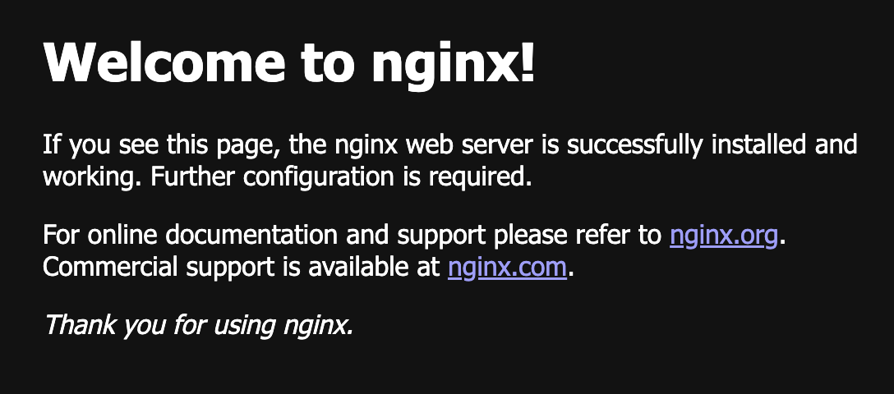
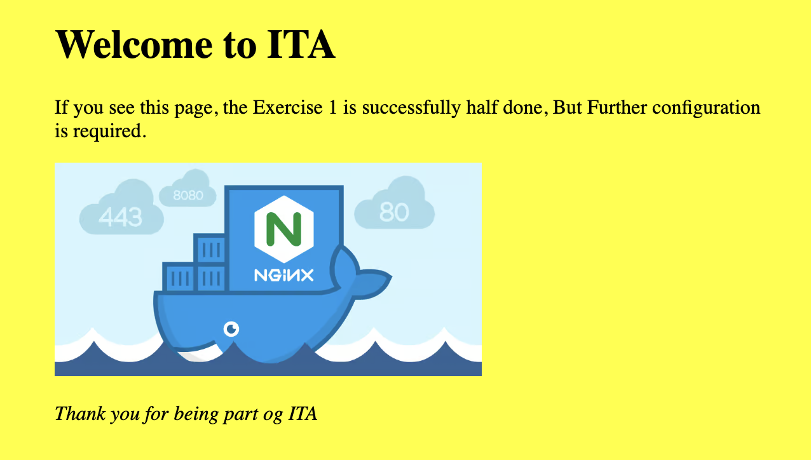

# Docker
I dag og næste gang skal vi arbejde med docker.    

## Læringsmål

* Forstå hvad docker er og hvad vi skal bruge det til.
* Have en forståelse for hvad Images, Containers og Dockerfiles er og hvordan de relaterer sig til hinanden.
* Kunne bygge et docker image med `docker build`, og kunne forstå og bruge flags som `--name`
* Kunne køre en docker container med `docker run`, og kunne forstå og bruge flags som `-it -rm -p -d --name --env`
* Kunne skrive og bruge en Dockerfil med kommandoerne `FROM, COPY, WORKDIR, RUN, CMD`    
* Kunne bygge et docker image med `docker build ...`    
* Kunne arbejde med et Github workflow der inkludere en Dockerfil.    

## Forberedels

Se de første ca. 28 minutter af denne video.   
Jeg har sat videoen til at starte 2:26 fra start, da det første ikke er relevant for jer.     
Fra 11:54 til 15:29 snakker manden on installation af docker. Det behøver i ikke at se, da i allerede har Docker installeret.    
De sidste 20 minutter er en introduktion til Linux, og det har vi jo haft.    

* [Docker Tutorial for Beginners](https://youtu.be/pTFZFxd4hOI?feature=shared&t=146) (27:54)

I skal desuden køre disse 2 kommandoer i `gitbash` (windows) eller `terminalen` (Mac)

* `docker pull ubuntu:latest` (Dette downloader et ubuntu linux image til din computer)
* `docker pull nginx:latest` (Dette downloader et nginx webserver image til din computer)

Vi kommer til at bruge det i undervisningen, men for at undgå kø på skolens netværk skal i gøre det inden vi mødes.

## Dagens indhold

* [Tutorial: Create a container app with Visual Studio Code](https://learn.microsoft.com/en-us/visualstudio/docker/tutorials/docker-tutorial?WT.mc_id=vscode_docker_aka_getstartedwithdocker)
* Herefter snakker vi udfra dette [Docker CheatSheet](docker_cheatsheet.md)
* Og laver dernæst en Hello World python/docker applikation sammen.
* Og så ... øvelserne herunder. 

## Materialer

* [Docker Tutorial for Beginners](https://youtu.be/pTFZFxd4hOI?feature=shared&t=146) (27:54)
* [Docker CheatSheet](docker_cheatsheet.md)

### Øvelser

#### Øv 1: Lav en ny startside til din nginx server

Kør kommandoen: `docker run -it --rm -p 8080:80 nginx` for at starte din nginx webserver.    
Hvis du går til `http://localhost:8080` kan du se denne side:    

    

**Du skal ændre den så den viser din egen html startside. Feks sådan en:**    

     
    

I vil kunne se hvor html filen er placeret i filsystemet her : https://hub.docker.com/_/nginx   

HINT: I kender til Linux OS, og i har før redigeret i tekstfiler gennem terminalen. 

---

#### Øv 2: Ændre portnummer på din nginx server

Stop din nginx server container og start den igen men nu så du kan se den via denne url:

`http://localhost:9000`    

Stop din nginx server container og start den igen men nu så du kan se den via denne url:

`http://localhost`

#### Øv 3: Pull og kør en rigtig app :)

Åben din gitbash, eller terminal. Kør kommandoen:    

`docker run -it --rm -p 5000:5000 clbo/flask_crud_demo:0.1.0`    

Hvis det virker kan du i din browser se en kørende applikation.

`http://localhost:5000`     

Hvis i går ind i containeren gennem terminalen i Docker Desktop, kan i desuden se alle de filer der er i imaged.     

* [Koden på Github kan i også finde her](https://github.com/ITAKEA/flask_crud_demo/tree/master)
* [Image på dockerhub kan i finde her](https://hub.docker.com/r/clbo/flask_crud_demo)

#### Øv 3a: Clone fra github og build et image
En anden måde at opnå det samme resultat er ved at clone fra github og bygge image + køre container.    

Clon dette repsotiroy: [Koden på Github](https://github.com/ITAKEA/flask_crud_demo/tree/master)

* Build et image udfra dets Dockerfil.    
* Kør en container 
* Se det i browseren
 
    
#### Øv 4: Lav en Dockerfil og et Image
I skal nu lave et docker image som indeholder det flask api projekt som i lavede sidste uge.    

* Det betyder at I i jeres projekt skal tilføje en Dockerfil.        
* Når i har gjort det skal i lave et image udfra den Dockerfil.     
* Og så skal i køre jeres applikation ved at skrive `docker run .............`    

