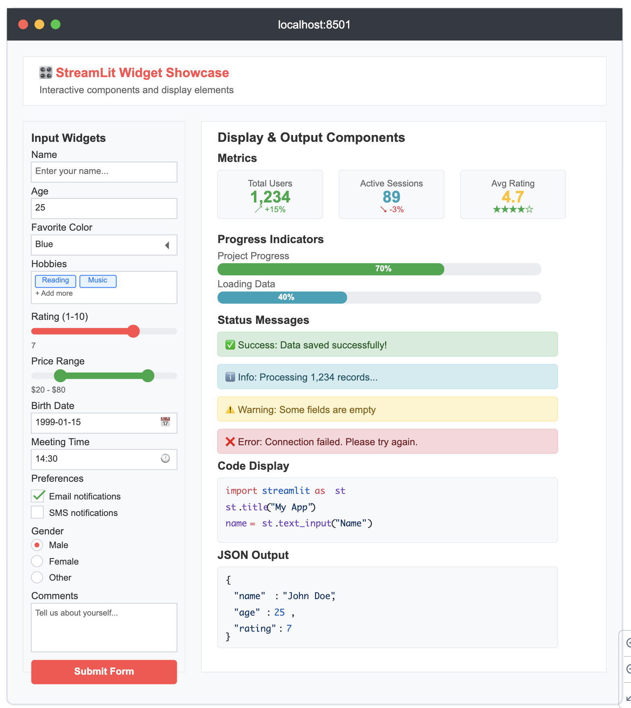

# Streamlit Frontend
I dag skal vi arbejde med et frontend framework som ikke skrives i html eller javascript, men i python.    

Vi vil først gennemgå de basale dele af dokumentetionen og herefter laver i et MVP af jeres eget projekt (evt. eksamenprojekt) 

## Læringsmål
* Kunne lave et MVP med Streamlit

## Forberedelse 

* Dan dig et overblik over hvad [Streamlit.io](https://streamlit.io/) frameworket er og kan.
* Brainstorm over ideer til hvilket projekt du vil kunne lave med dette framework. 

## Dagen i dag
* Vi starter med en gennemgang af dokumentationen [Streamlit.io](https://streamlit.io/) og laver nogle mindre øvelser.
* Herefter laver i jeres eget projekt.
* [Demoprojekt fra klassen](https://github.com/ITAKEA/streamlit_demo.git)

## Materiale
*  [Streamlit.io](https://streamlit.io/)

### Øvelser
* Mock-up øvelse
Lav en applikation der ligner den du kan se på billedet herunder.    

De elementer du skal bruge er:

**Input Widgets (Left Sidebar):**    

* st.text_input() - Name field
* st.number_input() - Age field
* st.selectbox() - Color dropdown
* st.multiselect() - Hobbies selection
* st.slider() - Rating slider
* st.select_slider() - Price range
* st.date_input() - Birth date picker
* st.time_input() - Meeting time
* st.checkbox() - Notification preferences
* st.radio() - Gender selection
* st.text_area() - Comments field
* st.button() - Submit button

**Display & Output Components (Main Area):**    

* st.metric() - KPI cards with deltas
* st.progress() - Progress bars
* st.success(), st.info(), st.warning(), st.error() - Status messages
* st.code() - Syntax highlighted code
* st.json() - Formatted JSON display

---
* Udvikel jeres egen app med brug af Stremalit.
    * I skal brug requests og kontakt et api, (som api.github.com eller lignende.)
    * I skal have multiple oages i jeres applikation.
    * I skal bruge text_input felter i jeres applikation
    * I skal have en requirement.txt fil.
---
* Host jeres applikation online på https://share.streamlit.io/

