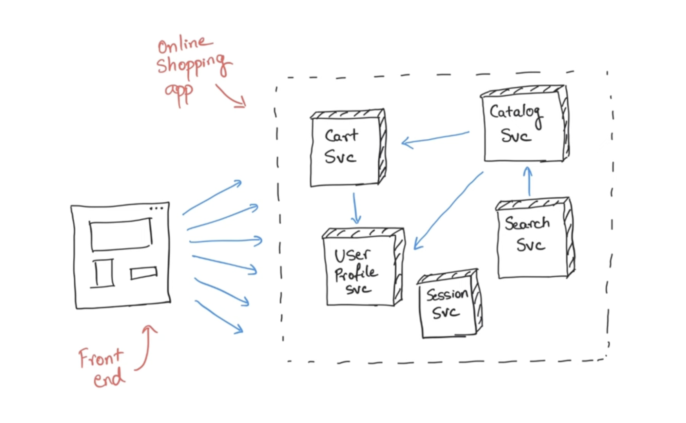
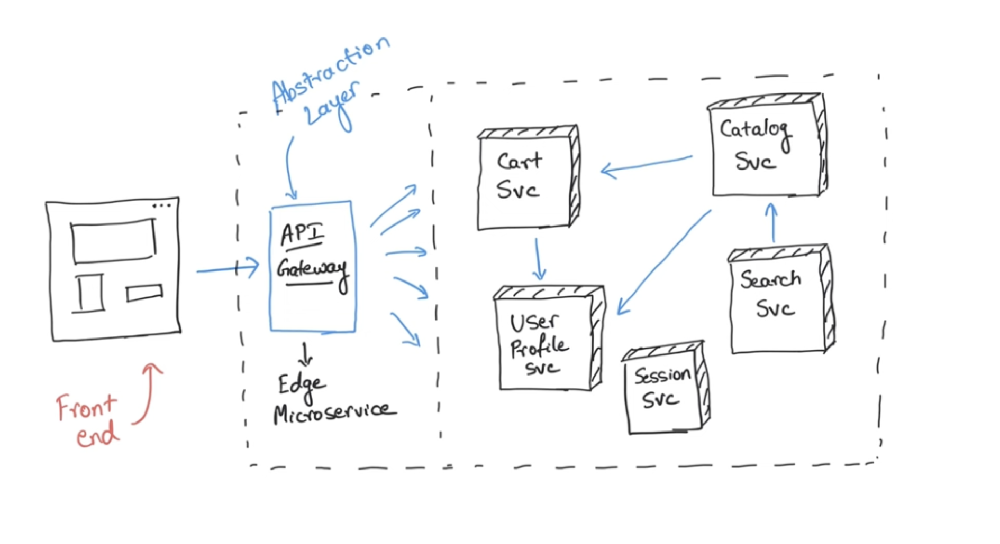

# Api-Gateway og JWT
<!--
Vi fortsætter med e-handels platformen fra sidste gang, men tilføjer nu et element mere: en API GATEWAY
-->

## Læringsmål
* Forstå konceptet og kunne oprette en Api Gateway
* Dokumentere endpoints for alle Microservices
* Forstå conceptet Low Coupling i forbindelse med Microservices.
* Kunne opsætte et docker network med Docker compose

## Forberedels
* [What is API gateway really all about? Java Brains - Brain Bytes](https://www.youtube.com/watch?v=1vjOv_f9L8I) (8:55)
* [Low Coupling](http://principles-wiki.net/principles:low_coupling)
* [Wikipedia - Coupling](https://en.wikipedia.org/wiki/Coupling_(computer_programming)) 

## Dagens indhold

**Abstraction**

<!--
Docker network "problemer" kan løses ved at følge denne meget korte vejledning:  
* [Docker Cheatsheet](materialer/docker_cheatsheet.md)
-->
## Materialer

<!--
* [Kode fra undervisningen - Shopping Site Microservices](https://github.com/ITAKEA/Shopping_Site_Microservices/tree/master)
* [Docker Cheatsheet](docker_cheatsheet.md)
* [Evironment variabler](../restapi1/env.md)
-->
<!--
* [Product Catalog Service](https://github.com/ITAKEA/product_service)
* [Inventory Service](https://github.com/ITAKEA/inventory_service)
-->

### Øvelser

* Tilføj et API GATEWAY til jeres Kong Arthur projekt

