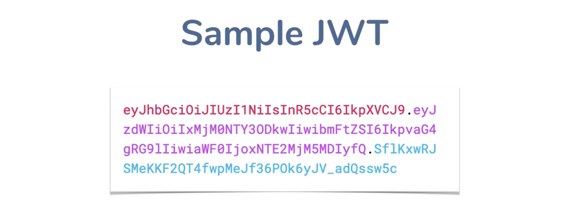
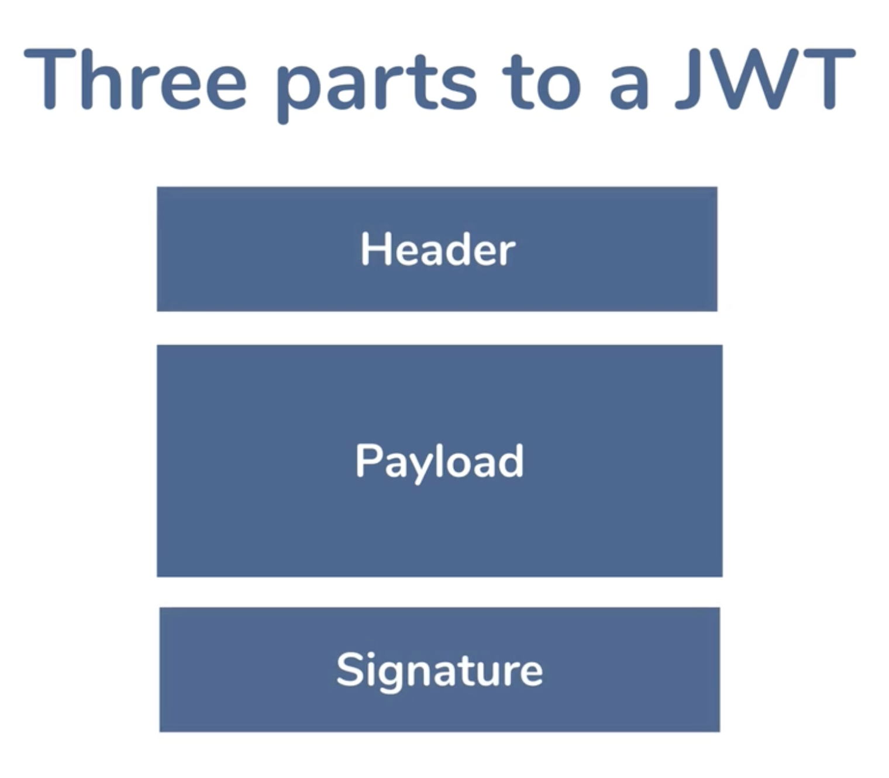
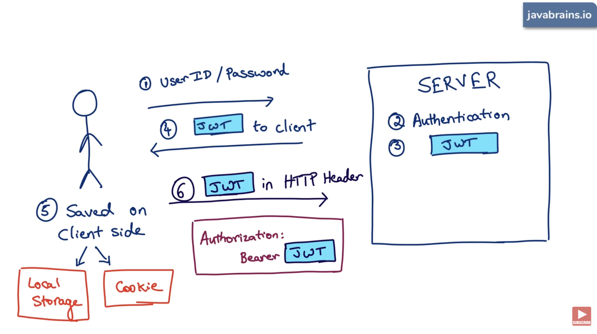
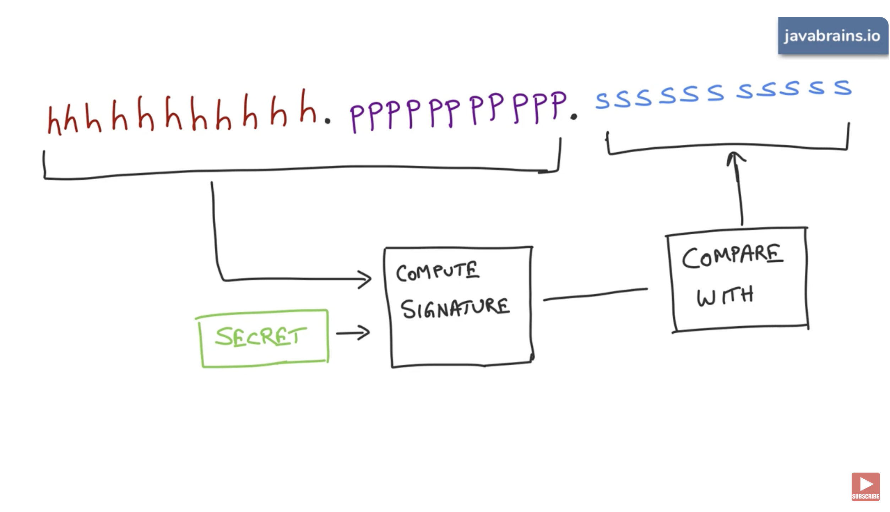

# Authorization med JWT
I dag skal vi arbejde med Authorization og med Json Web Token (JWT). Vi skal desuden kigge på hvordan man gemmer denne token i en cookie.

## Læringsmål
* Kunne forklare begrebet Authorization i forbindelse med en Microservice arkitektur
* Kunne forklare forskellen på Authentication og Authorization.

## Forberedelse
* [What is JWT? JSON Web Tokens Explained (Java Brains)](https://www.youtube.com/watch?v=soGRyl9ztjI) (14:52)
* [What is the structure of a JWT - Java Brains](https://www.youtube.com/watch?v=_XbXkVdoG_0) (17:45)

## Dagens indhold 

Det vi kommer til at gennemgå i timerne i dag er der dokumentation til her:

* [Flask-JWT-Extended's Documentation](https://flask-jwt-extended.readthedocs.io/en/stable/)
    * [Configuration Options](https://flask-jwt-extended.readthedocs.io/en/stable/options.html)
        * JWT_ACCESS_TOKEN_EXPIRES
        * JWT_TOKEN_LOCATION
        * JWT_HEADER_NAME
        * JWT_HEADER_TYPE
        * JWT_ACCESS_COOKIE_NAME

Omkring JWT "recapper" vi dette fra videoen:

--- 

---

---

---
Og vi kigger på brugen af dette tool:

* [JWT Debugger](https://jwt.io/#debugger-io)
* [Cryptii.com](https://cryptii.com/)

* [Kodeeksempel fra undervisningen]()

<!-- TODO -->
<!-- 
* Implementer JWT
* Implementer cookie
* Implementer roller (admin/employee/bruger)
 -->

