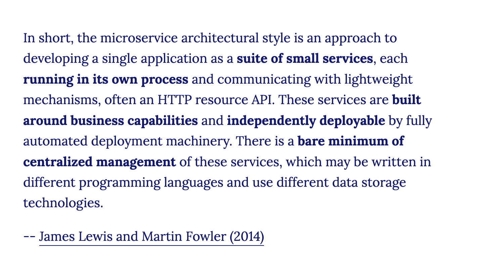

# Microservices 1

## Forberedels

Se denne video og læs artiklen:    
* [Video: What are Microservices?](https://www.youtube.com/watch?v=CdBtNQZH8a4) (6:37)
* [Microservices (Martin Fowler)](https://martinfowler.com/articles/microservices.html) (30:00)   

## Læringsmål
* Have viden om grundprincipperne i hvad en Microservice arkitektur er
* Kunne bygge microservices der arbejder sammen gennem et JSON API

## Dagens indhold
<!--
Vi starter dagen med en gennemgang af hvordan i kan vha. environment variabler, docker volumens kan opnå persistens på tværs af jeres docker images og containers. (det som vi skulle have lavet sidste onsdag).
-->

Herefter laver vi en services fra øvelsen herunder sammen ved tavlen, og i fortsætter i grupper med øvelsen. 

## Materialer

* [Query parametre](materialer/routes.md)
* [Video: What are Microservices?](https://www.youtube.com/watch?v=CdBtNQZH8a4) (6:37)
* [Microservices (Martin Fowler)](https://martinfowler.com/articles/microservices.html)
* [Kode fra undervisningen (Docker)](https://github.com/ITAKEA/kode_fra_undervisning_e24/tree/master/docker)
* [Kode fra undervisningen (account_service)](https://github.com/ITAKEA/account_service)

<!--
Todo: Lav en tutorial og video baseret på denne artikkel, men med Azure som host
* [How To Build and Deploy Microservices With Python](https://kinsta.com/blog/python-microservices/)

## flask-change-microservice

* [Building a Realistic Microservice Step-By-Step with Flask](https://www.youtube.com/watch?v=QauGyIdGiNc)
* [flask-change-microservice](https://github.com/noahgift/flask-change-microservice/tree/main)

-->

### Øvelser
#### Shopping Site Microservices
Listen herunder indeholder nogle forslag til hvad en online markedsplads, som feks. Amazon.com kunne indeholde af Microservices.    
Vi har sammen lavet Account Service og I skal nu i grupper lave en service yderligere.     
I skal arbjede sammen med minimum en anden gruppe, som har udviklet deres egen service (en anden service end jer).     
I skal vælge services der interagere med hinanden.         

I forhold til Product Catalog Service (hvis i laver den) kan i med fordel bruge data fra dette [api](https://dummyjson.com/docs). Vær opmærksom på at ikke alt data fra dette api kan bruges dirrekte (feks. vil i helt sikkert gerne kunne sætte en anden pris på produkterne end det der står i api´et).        
 
Husk at jeres services så vidt det er muligt skal kunne fungere uden de andre services. Ikke nødvendigvis perfekt, men men dog godt nok til at de stadig kan bruges uden at være stærkt afhængig af de andre services.

**Docker**
Jeres services skal køre i hver deres docker container, og i skal gøre brug af environment variabler hvor det giver mening. I skal også sørge for at jeres images kan arbejde med persistent data via volumes.    

I skal i README filerne til alle Services beskrive jeres endpoints.
 
Sørg for at lave jeres services simple og kun med de nødvendige funktionaliteter (KISS).     

1. **Account Service**:
   - Håndterer brugerkonti, herunder registrering, autentificering og profiladministration.
   - Behandler login, logout, passwordhåndtering og brugerroller.

2. **Product Catalog Service**:
   - Styrer listen over tilgængelige produkter, inklusive detaljer såsom navn, beskrivelse, pris og billeder.
   - Tilbyder funktionalitet til at søge, filtrere og kategorisere produkter.

3. **Inventory Service**:
   - Håndterer lagerbeholdningen for produkter.
   - Sporer ændringer i lageret (f.eks. justeringer af mængden efter salg).

4. **Order Service**:
   - Håndterer ordreplacering, behandling og sporing.
   - Administrerer livscyklussen for en ordre fra oprettelse til opfyldelse.

5. **Payment Service**:
   - Behandler betalinger for ordrer.
   - Integrerer med betalingsgateways og styrer transaktionsregistre.

6. **Cart Service**:
   - Håndterer brugernes indkøbskurve.
   - Tilbyder funktioner til at tilføje, fjerne og opdatere varer i kurven.

7. **Shipping Service**:
   - Beregner forsendelsesomkostninger og styrer leveringsmuligheder.
   - Sporer forsendelser og opdaterer ordrestatus ved levering.

7. **Currency Service**:
   - Håndterer omregning mellem forskellige valutaer for at sikre, at priserne vises korrekt afhængigt af brugerens valgte valuta.
   - Opdaterer valutakurser i realtid ved at integrere med eksterne valutakurseressourcer og API'er.
   - Giver funktionalitet til at indstille eller vælge en foretrukken valuta for både brugere og administratorer.

8. **Review and Ratings Service**:
   - Giver brugerne mulighed for at anmelde og vurdere produkter.
   - Styrer moderation og visning af brugergenereret indhold.

9. **Notification Service**:
   - Sender meddelelser til brugerne (f.eks. ordrebekræftelser, forsendelsesopdateringer).
   - Kan håndtere forskellige kanaler som e-mail, SMS eller push-beskeder.

10. **Search Service**:
    - Tilbyder fuldtekstsøgning på tværs af produkter.
    - Implementerer funktioner som auto-forslag og forudsigende søgning.

11. **Analytics Service**:
    - Samler og behandler data til rapportering og indsigt.
    - Tilbyder dashboards og metrikker for salg, brugeradfærd osv.

12. **Recommendation Service**:
    - Foreslår produkter til brugerne baseret på deres adfærd og præferencer.
    - Implementeres ved hjælp af algoritmer som samarbejdsfiltrering eller indholdsbaseret filtrering.

