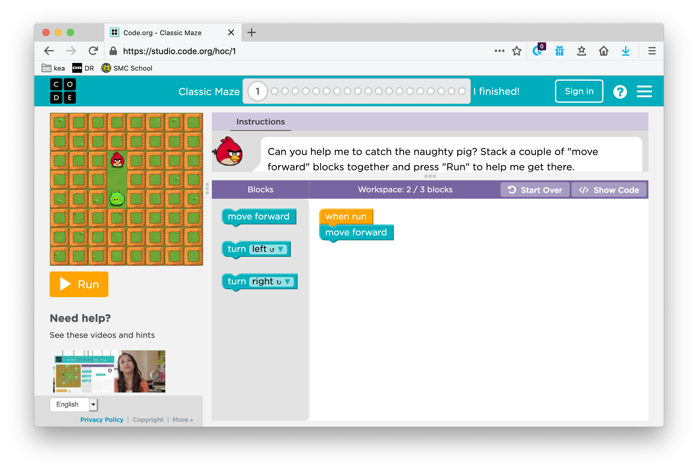

# Øvelser OOP

## Øvelse 1: Bank Øvelse

[Løsning](exercises/solution/04_oop/solution.rst)

Opret en Bank, en Konto, og en Kunde klasse.

- Alle klasser skal være i hver deres modul (.py fil).
- Bankklassen skal kunne indeholde mange konti.
- Du skal kunne tilføje nye konti.
- Kontoklassen skal have relevante detaljer.
- Kundeklassen skal også have relevante detaljer.

Husk at gøre din kode "pythonic"; den skal være simpel, let at læse, præcis og uden unødvendig kode. Hold dig til de teknikker, vi har dækket indtil nu.

### \_\_init\_\_
- Tilføj muligheden for at dine objecter kan tage imod forskellige parametre når de oprettes. Eks.: 

````
    kunde1 = Kunde('Benny', 66) 
    kunde2 = Kunde('Birthe', 74, 'Pensionist')
````

## Øvelse 2: Angry Bird

[Løsning](exercises/solution/04_oop/solution.rst)

I denne øvelse skal du oprette en simpel terminalversion af dette [Angry Bird online kodningslæringsværktøj for børn](https://studio.code.org/hoc/1).



Du skal lave dette som en OOP-applikation, og dine klasser kunne se sådan ud:

**Fugl**

Skal kende sin *nuværende position* og skal vide, i hvilken *retning* den bevæger sig. Den skal kunne *bevæge sig fremad*, *dreje til venstre* og *dreje til højre*. Den skal også have en handling, der aktiveres, når den taber spillet, og en, når den vinder.

**Gris**

Skal kende sin *position*. Den skal også have en handling, der aktiveres, når den taber spillet, og en, når den vinder.

**Bræt**

Skal initialisere en Fugl og en Gris objekt. Den skal *vise* brættet med fuglen og grisen i startpositioner. Den skal have en *kørselsmetode*.

```plaintext
*  *  *  *  *  *  *  *  *  *
*  *  *  *  *  *  *  *  *  *
*  *  B  *  *  *  *  *  *  *
*  *  *  *  *  *  *  *  *  *
*  *  *  *  *  *  *  *  *  *
*  *  *  *  *  *  *  *  *  *
*  *  *  *  *  *  *  *  *  *
*  *  *  *  *  *  P  *  *  *
*  *  *  *  *  *  *  *  *  *
*  *  *  *  *  *  *  *  *  *
```

**Arbejdsområde**

Skal have en visningsmetode, der udskriver instruktioner om, hvad man skal gøre. Den skal have en metode, der er ansvarlig for at oprette en samling af kommandoer fra brugerinput.

**Spil**

Denne klasse er ansvarlig for at køre applikationen. Den skal oprette objekter af Bræt og Arbejdsområde og kalde deres visningsmetoder. Den skal også være ansvarlig for at afgøre, om fuglen ramte grisen eller ej.

### Screencast

Du kan se en prototype af denne øvelse her. Du er selvfølgelig velkommen til at forbedre spillet, men dette kunne være en løsning.

* [Angry bird inspiration](https://youtu.be/n9Ths1CSCkU?si=gBvTNk3p4Odux7yQ)


## Øvelse 3: OOP promt øvelser

Kopier/indsæt dette i din LLM prompt.

```plaintext
Jeg vil gerne have en score for, hvor godt min Python-programmering med fokus på pythonic OOP er. Scoren skal være fra 1 til 10.

Du skal give mig øvelser en ad gangen. Øvelsen skal løses med kode. Øvelserne skal matche det niveau, du tror, jeg er på.

Du vil give øvelsen, og jeg vil give dig koden. For hver øvelse skal du skrive, hvilket niveau du tror, jeg er på.

Når du er sikker på mit niveau, skal du generere en rapport. Rapporten skal indeholde følgende:
1. Det niveau, du tror, jeg er på.
2. Feedback på den kode, jeg skrev.
3. Hvor jeg skal fokusere for at forbedre mig.

Lad os starte med det første spørgsmål.
```
