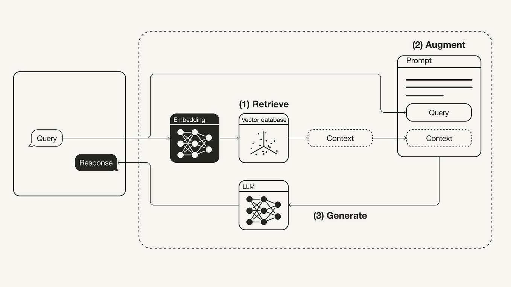

# Retrieval-Augmented Generation (RAG)
I dag og de næste 2 gange skal vi arbejde med **Retrieval-Augmented Generation (RAG)** systemer. 

Retrieval-Augmented Generation kan oversættes til “kilde- eller opslags-understøttet prompting”. Idéen er, at vi først laver opslag i relevant materiale og derefter bygger en prompt til en LLM, hvor de fundne tekstuddrag indgår som kontekst. I vores tilfælde betyder “opslag” typisk søgning i én eller flere PDF’er.
Stiller vi fx spørgsmålet: *“Hvor mange gange sejler Odysseus over det Ægæiske Hav?”*, søger vi i **Odysseen** efter information om dette, udvælger de mest relevante afsnit og sender dem i prompten sammen med vores spørgsmål. LLM’en bruger så disse uddrag til at give et svar, der er forankret i de tekststumper vi sender med.

Så en kort flowbeskrivelse kunne være:
1. Stil spørgsmål
2. Søg i dokumenter lokalt
3. generer en promt med med søgeresultater og brugerens spørgsmål
4. Send prompt til LLM API
5. Få kildeunderstøttet svar tilbage

**I dag**    
Har vi fokus på at få et overblik over dette flow eller denne arkitektur vores RAG system følger, og vi fokusere efterfølgende på elementerne "Embeddings" og Vectordatabaser.

**Næste gang**     
Arbejder vi med "prompt generering" og med at få systemet til at fungere med både backend og frontend.

## Læringsmål
* Forstå og kunne forklare konceptetet RAG 
* Forstå hvad embeddings er og hvordan de bruges af LLM´s
* Kunne opdele en tekst i "Chunks", og kunne forklare hvorfor dette er vigtigt.
* Kunne bruge en ChromaDB database

## Forberedelse
I skal starte med at se denne video om hvad RAG er sådan helt overordnet set:

* 

## Dagen indhold
* TODO: slides om RAG, chunking, indexing, vectore, simularity search

## Materialer
* [What is a Vector Database? Powering Semantic Search & AI Applications](https://www.youtube.com/watch?v=gl1r1XV0SLw) (9:48)
* [OpenAI Embeddings and Vector Databases Crash Course](https://www.youtube.com/watch?v=ySus5ZS0b94) (18:40)

