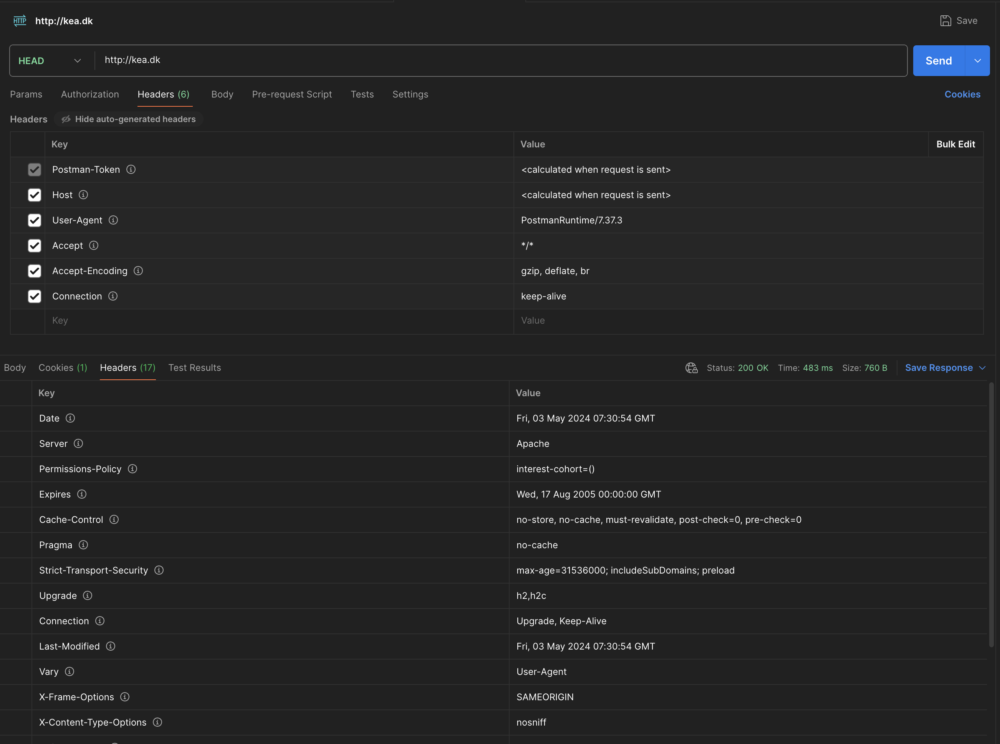
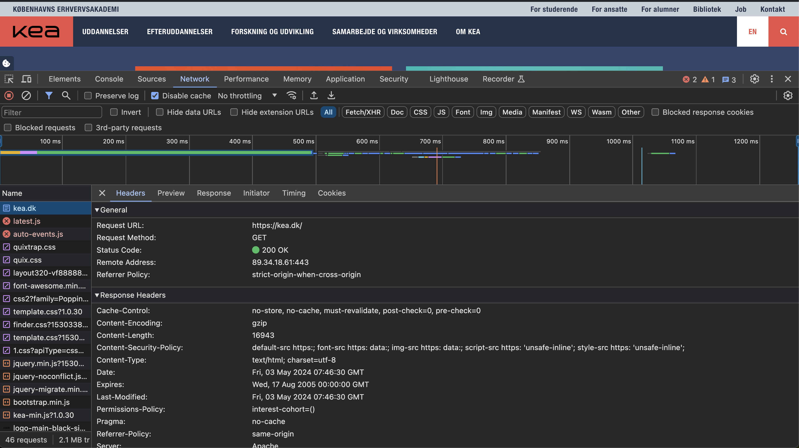
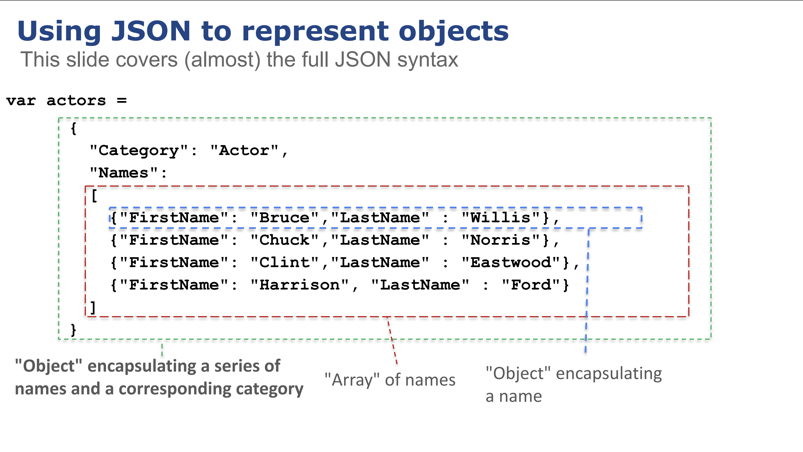
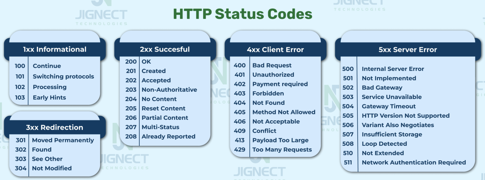

# Http protokollen
**_(Noter fra undervisningen i klassen)_**


### Postman





### Browserens inspect tab




### Python requests

Du skal bruge ```requests``` biblioteket, så det skal installeres

```
    pip install requests
```

``` 
    >>> import requests
    >>> res = requests.get('http://kea.dk')
    >>> res.headers
    {'Date': 'Fri, 03 May 2024 07:50:10 GMT', 'Server': 'Apache', 'Permissions-Policy': 'interest-cohort=()', 'Expires': 'Wed, 17 Aug 2005 00:00:00 GMT', 'Cache-Control': 'no-store, no-cache, must-revalidate, post-check=0, pre-check=0', 'Pragma': 'no-cache', 'Strict-Transport-Security': 'max-age=31536000; includeSubDomains; preload', 'Upgrade': 'h2,h2c', 'Connection': 'Upgrade, Keep-Alive', 'Last-Modified': 'Fri, 03 May 2024 07:50:10 GMT', 'Vary': 'Accept-Encoding,User-Agent', 'Content-Encoding': 'gzip', 'X-Frame-Options': 'SAMEORIGIN', 'X-Content-Type-Options': 'nosniff', 'Referrer-Policy': 'same-origin', 'Content-Security-Policy': "default-src https:; font-src https: data:; img-src https: data:; script-src https: 'unsafe-inline'; style-src https: 'unsafe-inline';", 'Content-Length': '16903', 'Keep-Alive': 'timeout=5, max=200', 'Content-Type': 'text/html; charset=utf-8'}
```

## Json

---

---

--- 

---
